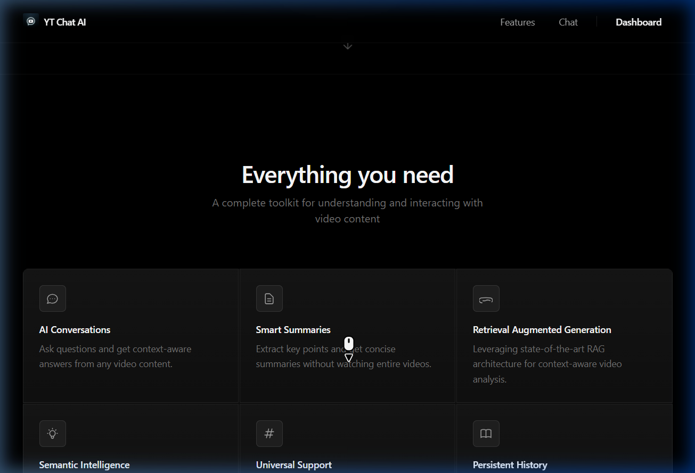
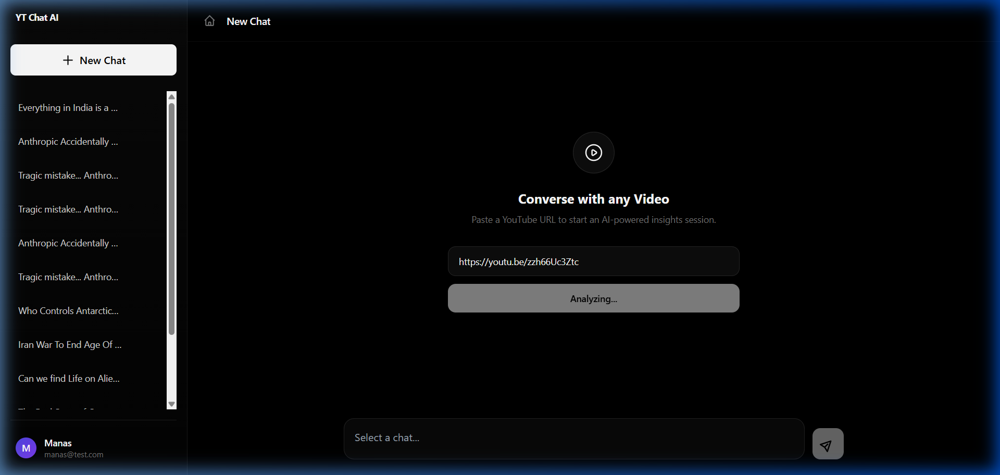
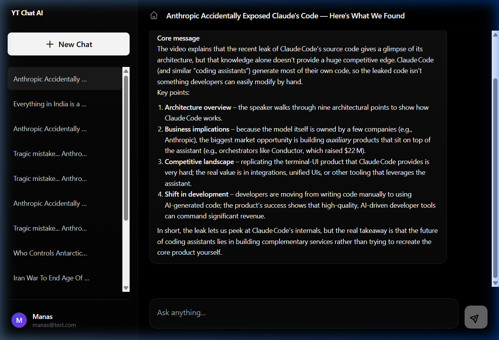
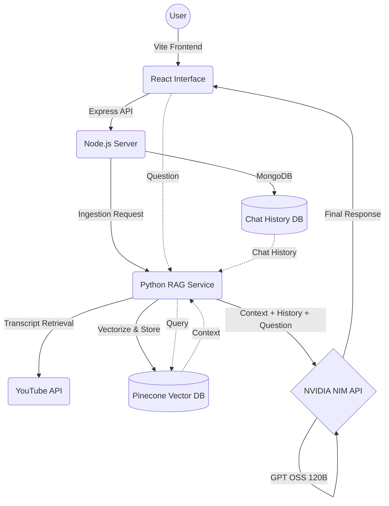

# 🎥 YT Chat AI | Converse with any YouTube Video

[](https://yt-ai-chat.onrender.com)
[](#-tech-stack)

**YT Chat AI** is a production-grade Retrieval-Augmented Generation (RAG) platform that transforms passive video watching into an active, intelligent conversation. Simply paste a YouTube URL and unlock a semantic understanding of its content instantly.

---

## 🌟 Live Demo & Experience

### **The Intelligent Landing**
Experience a minimalist, SaaS-native design that puts the user focus on the core value: **Context-Aware Insights**.


### **Cold-Start Resilience**
Built with Render's free-tier limitations in mind, our system features a custom polling and non-blocking ingestion flow that ensures a stable experience even during Python service wake-ups.


### **Semantic Conversations**
Ask complex questions about video transcripts and receive detailed, structured insights powered by LangChain and OpenAI.


---

## 🔥 Key Features

- **🚀 Real-time Transcription RAG**: Instantly ingest and vectorize YouTube transcripts for deep semantic search.
- **🧠 Semantic Intelligence**: Context-aware AI that understands abstract concepts, not just keywords.
- **🛡️ Cold Start Resilience**: Intelligent polling and retry logic to handle backend wake-up times (Production-ready stability).
- **🎨 Glassmorphic UI**: High-end minimalist design with smooth animations and dynamic viewport locking.
- **📱 Fully Responsive**: Seamless experience across mobile, tablet, and desktop.

---

## 🛠️ Tech Stack

### **Frontend**
- **React + Vite**: Atomic component architecture for high-speed performance.
- **Tailwind CSS**: Custom design system with glassmorphism and modern typography.
- **Axios**: Standardized API communication with session persistence.

### **Backend (Node.js)**
- **Express**: Robust RESTful API layer.
- **MongoDB + Mongoose**: Scalable session and chat history management.
- **JWT + Cookies**: Secure cross-site authentication with `SameSite: none`.

### **RAG Engine (Python)**
- **LangChain**: Orchestrating the retrieval and generation pipeline.
- **OpenAI GPT OSS 120B**: High-performance inference via **NVIDIA NIM API**.
- **`langchain-nvidia-ai-endpoints`**: Specialized library for NVIDIA-hosted high-compute models.
- **Pinecone**: Low-latency vector database for transcript embeddings.
- **FastAPI**: Lightweight microservice for non-blocking ingestion.

---

## 🏗️ Technical Architecture



---

## 🚀 Local Setup

### 1. Prerequisites
- Node.js (v18+)
- Python (v3.10+)
- OpenAI & Pinecone API Keys

### 2. Clone the Repository
```bash
git clone https://github.com/ManasArora33/youtube-rag-system.git
cd youtube-rag-system
```

### 3. Backend Setup
```bash
cd backend
npm install
# Create .env and add PORT, MONGO_URI, JWT_SECRET, PYTHON_SERVICE_URL
npm run dev
```

### 4. Python RAG Service Setup
```bash
# In a new terminal
cd python-rag
pip install -r requirements.txt
# Add OPENAI_API_KEY and PINECONE_API_KEY to .env
python app.py
```

### 5. Frontend Setup
```bash
cd frontend
npm install
# Add VITE_BASE_URL to .env
npm run dev
```

---

## 🛡️ Stability & Production Readiness

Unlike typical prototypes, this system is a **"Cold Start Warrior"**. It addresses the common "service sleeping" issue on platforms like Render by implementing:
- **Non-blocking Ingestion**: `createChat` returns a `201` status immediately, allowing the UI to show a loader while the background service wakes up.
- **Intelligent Polling**: The frontend uses a recursive status-check loop to detect when the vector database is ready.
- **Cookie Security**: Configured with `trust proxy` and `SameSite: none` for reliable cross-site session management.

---

Developed with ❤️ by [Manas Arora](https://github.com/ManasArora33)
